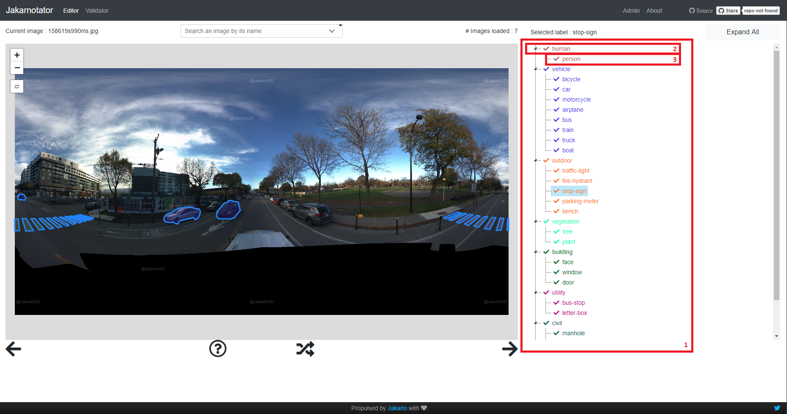

# Installation
## With Docker (recommended)
```
# Development
docker-compose -p dev -f docker-compose.dev.yml up --build --force-recreate

# Production
JAKARNOTATOR_PORT_MAPPED=80 docker-compose -p prod -f docker-compose.yml up --build --force-recreate
```

## On your machine
You need to have your redis server on.
Grafana and Prometheus are also required.

```
cd jakarnotator
npm install

# for DEV :s
# On bash terminal:
DEBUG=jakarnotator:* npm run dev
# On powershell:
$env:DEBUG='jakarnotator:*'; npm run dev

# for PROD :
# On bash terminal:
PORT=80 DEBUG=jakarnotator:* npm start
# On powershell:
$env:PORT='80';$env:DEBUG='jakarnotator:*'; npm start
```

# First steps
## Create a new class
Classes are displayed on the left side of the screen (1):
<div align="center">
  
</div>

The element (2) represents the supercategory to which the class (3) is associated.

To create your own supercategory or class you need to modify the file [annotation_list.json](jakarnotator/public/data/annotation_list.json)
```
The hierarchy tree is based on Coco's :
Shape
    |___ Civil
    |___ Utility
             |___ Bus-Stop
             |___ Letter-Box
    .
    .
    .
    |___ Default
```

After the last element, add :
```
{
        "supercategory": SuperCategoryOFYourClass,
        "id": LastID+1,
        "name": YourClass
}
```

## Add your own images
Place them in [jakarnotator/public/data/images/](jakarnotator/public/data/images/)