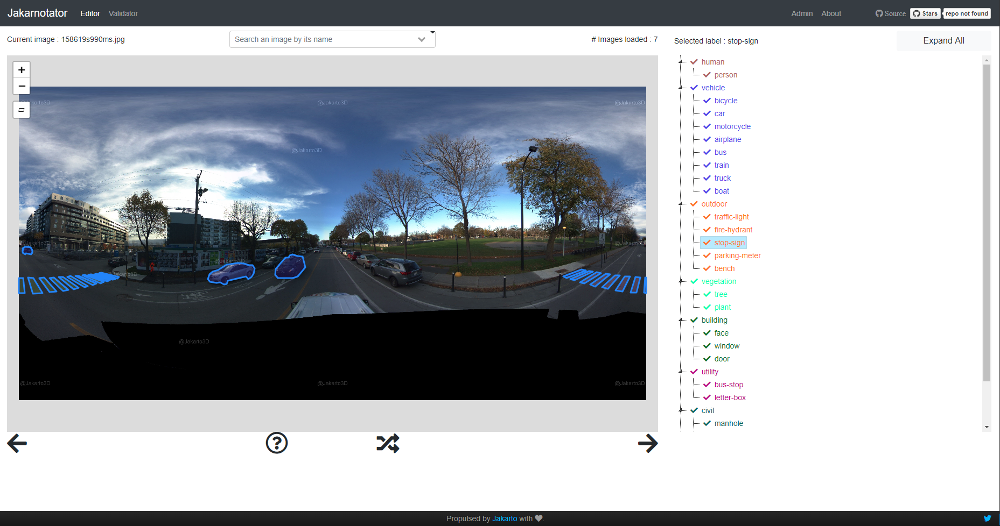

# Jakarnotator

The Jakarnotator is an annotation tool to create your own database for instance segmentation problem. Jakarnotator data are compatible with the format of [MS Coco database](http://cocodataset.org/#home).

The Jakarnotator is based on Leaflet. You can annotate any image format supported by Leaflet (.png, .jpeg, ...) and even georeferenced data. You just need to put those images into a specific folder. [Getting started](GETTING_STARTED.md)

At [Jakarto](http://www.jakarto.com), we used a Jakarnotator instance to create a database of urban furnitures. With these data we were able to train our models with the [Mask RCNN algorithm](https://arxiv.org/abs/1703.06870) (no modification needed to deal with input data format as [Detectron](https://github.com/facebookresearch/Detectron) *(a Mask RCNN implementation)* used MS Coco).

A live demo is available on [jakarnotator.jakarto.com](http://jakarnotator.jakarto.com).

# Links

To see the Jakarnotator in action please take a look to these two links :

- [Read more about the story of Jakarnotator](http://jakarnotator.jakarto.com/about).
- [Youtube introduction to Jakarnotator](https://youtu.be/SD2850tJv-M) (in French)

# Usage

Click [here](USAGE.md) if you want to learn how to annotate objects in the Jakarnotator

# Getting started

If you are even more interested in creating your database from your own images or create new classes of objects you should take a look to this [GETTING_STARTED.md](GETTING_STARTED.md).

# Contribute

Jakarnotator is open-sourced as a simple tool to ease the creation of instance segmentation databases. Feel free to open an issue for questions, details, new features...
